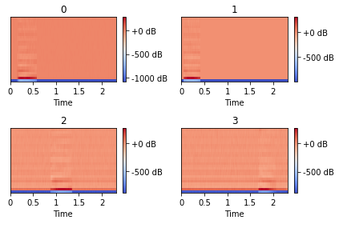
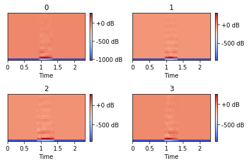
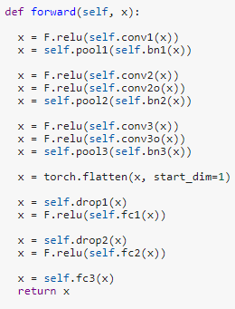
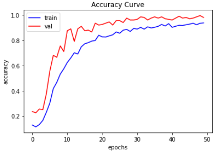
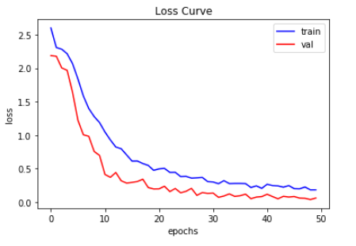

# spoken_digit_classify

#### *Train CNN in Pytorch to classify spoken numbers (0-9)*
---

Google Colab notebook where you can run the code with a GPU: https://colab.research.google.com/notebook#fileId=1JD685MRKYJyahfSdU8pirw5oqO4hxAiw&offline=true&sandboxMode=true

## Dataset

Used dataset: <a href='https://github.com/Jakobovski/free-spoken-digit-dataset'>free-spoken-digit-dataset</a>

Total 2000 wav files:
- 4 speakers, 500 recordings per speaker
- 50 recordings per digit per speaker

Dataset Specs:
- sampling rate = 8000 kHz
- mean clip length = 0.402 sec
- std length = 0.134 sec
- max length = 2.283 sec
- min length = 0.144 sec
- total length = 804.339 sec

Split randomly into training, validation, and testing (80% / 10% / 10%).

Validation set is used for evaluating which training epoch performed the best and to check for overfitting or underfitting. Because of this, validation set cannot be used for final test results, as that would possibly result in data leakage.

## Data Preprocessing

1. Apply pitch shifting and time stretching (speed up or slow down) data augmentation randomly to raw audio. CNN will see more realistic training examples to mimic real-life audio.
2. Adjust length of sound clips to 2.3 seconds (the max length clip in original dataset). Pad with zeros if clip is too short, and trim clip if time stretching made it too long. Apply zero-padding randomly on both sides of original clip, since spoken numbers won't be centered in middle of clip when network is predicting on real life speech.
3. Add gaussian noise to clip, filling in the previously added zero-padding. Since real-life speech rarely occurs in a silent vacuum, this will let model learn to ignore background noise.
4. Convert processed audio to Mel-Frequency Cepstral Coefficients (MFCC). These speech features are commonly used in the speech analysis field. Captures sound characteristics on frequencies familiar to the human ear. <a href='http://practicalcryptography.com/miscellaneous/machine-learning/guide-mel-frequency-cepstral-coefficients-mfccs/'> Detailed implementation guide</a>

Extract 25 MFCCs over 2.3 seconds, with <a href='https://en.wikipedia.org/wiki/Short-time_Fourier_transform/'> STFT </a> frame length being 0.023 seconds and frame hop 0.0115 seconds. This gives us input images of dimension 25 by 200:

Data Augmented Images:

	 

Original Images:

	 

## Model Architecture

Hyperparameters:
- Number of MFCCs = 25 (y-axis of input image to network)
- Duration of input clips = 2.3 sec (length of longest clip)
- Frame length = 0.023 sec (typical frame length for STFT)
- Frame hop = 0.0115 sec (half of frame length)
- Min Frequency = 0.0 Hz
- Max Frequency = 22050.0 Hz (human range of hearing)
- Learning rate = 3e-4
- Number of Epochs = 50
- Batch size = 50
- Optimizer = Adam
- Loss = Cross Entropy
- Activation = ReLU
	
Model Layers:

	 

	 

## Training and Validation

Accuracy curve over 50 epochs:

	 

Loss curve over 50 epochs:

	 

Final result:
- Best epoch: 49
- Training accuracy: 0.9344
- Training loss: 0.1986
- Validation accuracy: 0.995
- Validation loss: 0.0389
- Final Test accuracy: 0.97
- Final Test loss: 0.046

The training curve always performs slightly worse than validation, mostly because of the heavily augmented data we input to training makes the training set "harder" than the validation or test sets. This is fine, since it signifies our model hasn't overfit.

**What's Next?**

- Train network using larger number of speakers and samples. Maybe use data from this Kaggle competition: https://www.kaggle.com/c/tensorflow-speech-recognition-challenge
- Apply trained model to predict speech in real time using PyAudio. Check out "demo.py" in the repository! I use multithreading to allow the trained model to predict every 0.25 seconds on a constantly updating "tape" of audio from the past 2.3 seconds.
- Add noise removal and a filtering algorithm so that only clips of speech will be input for the model to classify in real time. A possibility is training an SVM to classify if a clip of sound "looks" like speech or not.

Thanks for checking out my repo! Email me any questions, concerns, or complaints about my model design choices! Email: wwzhang@umich.edu
