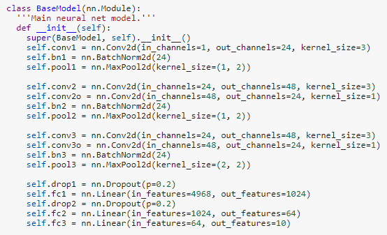

# spoken_digit_classify

#### *Train CNN in Pytorch to classify spoken numbers (0-9)*
---

## Dataset

Used dataset: <a href='https://github.com/Jakobovski/free-spoken-digit-dataset'>free-spoken-digit-dataset</a>

Total 2000 wav files:
- 4 speakers, 500 recordings per speaker
- 50 recordings per digit per speaker

Dataset Specs:
- sampling rate = 8000 kHz
- mean clip length = 0.402 sec
- std length = 0.134 sec
- max length = 2.283 sec
- min length = 0.144 sec
- total length = 804.339 sec

Split randomly into training, validation, and testing (80% / 10% / 10%).

Validation set is used for evaluating which training epoch performed the best and to check for overfitting or underfitting. Because of this, validation set cannot be used for final test results, as that would possibly result in data leakage.

## Data Preprocessing

1. Apply pitch shifting and time stretching (speed up or slow down) data augmentation randomly to raw audio. CNN will see more realistic training examples to mimic real-life audio.
2. Adjust length of sound clips to 2.3 seconds (the max length clip in original dataset). Pad with zeros if clip is too short, and trim clip if time stretching made it too long. Apply zero-padding randomly on both sides of original clip, since spoken numbers won't be centered in middle of clip when network is predicting on real life speech.
3. Add gaussian noise to clip, filling in the previously added zero-padding. Since real-life speech rarely occurs in a silent vacuum, this will let model learn to ignore background noise.
4. Convert processed audio to Mel-Frequency Cepstral Coefficients (MFCC). These speech features are commonly used in the speech analysis field. Captures sound characteristics on frequencies familiar to the human ear. <a href='http://practicalcryptography.com/miscellaneous/machine-learning/guide-mel-frequency-cepstral-coefficients-mfccs/'> Detailed implementation guide</a>

## Model Architecture

Hyperparameters:
- Number of MFCCs = 40 (y-axis of input image to network)
- Duration of input clips = 2.3 sec (length of longest clip)
- Frame length = 0.023 sec (typical frame length for STFT)
- Frame hop = 0.0115 sec (half of frame length)
- Min Frequency = 0.0 Hz
- Max Frequency = 22050.0 Hz (human range of hearing)
- Learning rate = 3e-4
- Number of Epochs = 25
- Batch size = 50
- Optimizer = Adam
- Loss = Cross Entropy
- Activation = ReLU
	
Model Layers:

	 

## Step 3 - Training

* **Accuracy** 

	 
	 
	<i>Model Accuracy</i>

* **Loss** 

	 
	 
	<i>Model Loss</i>

**We get 98% validation accuracy!**

## Step 4 - Test

We use the test data to check the model performance on new data. Based on the results, we get 97% accuracy!

             precision    recall  f1-score   support

          0       1.00      0.84      0.91        19
          1       0.87      0.87      0.87        15
          2       1.00      1.00      1.00        23
          3       0.91      1.00      0.95        10
          4       1.00      1.00      1.00        10
          5       1.00      1.00      1.00        23
          6       1.00      1.00      1.00        13
          7       0.93      1.00      0.96        13
          8       1.00      1.00      1.00        14
          9       0.91      1.00      0.95        10

	avg / total       0.97      0.97      0.97       150
	

We have thus trained a Neural Network to correctly classify spoken digits.
